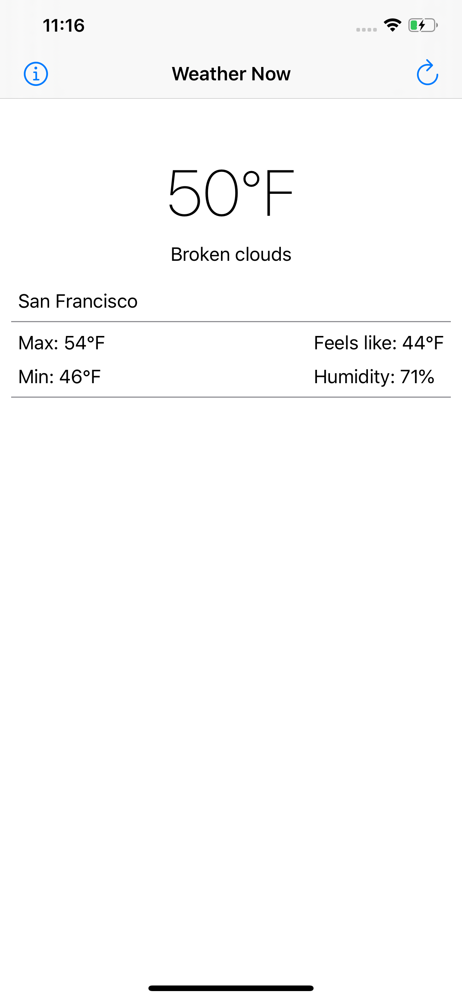
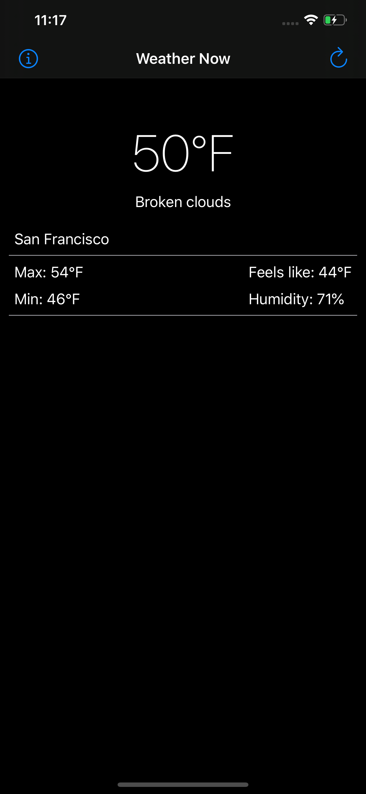

# WeatherNow
A Simple Weather App for iOS, using [OpenWeather](https://openweathermap.org/) public API.

## Features
* Simple design
* Automatically get forecast based on user's location
* Supports Light and Dark mode
* Available in:
  * English
  * Portuguese (Brazil)

## Screenshots
| Light mode | Dark mode |
| ------------- | ------------- |
|  |  |

## Requirements
* iOS 12.1 or above
* Swift 4
* Xcode 11.3

## Built with
* [Alamofire](https://github.com/Alamofire/Alamofire)

## Disclaimer
This is a work in progress. More features will be added in the future

## Copyright
Icons made by [Freepik](https://www.flaticon.com/authors/freepik/) from [www.flaticon.com](https://www.flaticon.com/).

## License
This project is licensed under the MIT License - see the LICENSE.md file for details